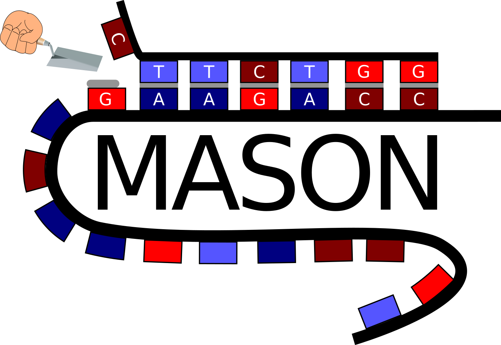

Author: Jakob Jung

Date: 03-05-2022

This is the github page of the MASON webserver. MASON (**M**ake **A**nti**S**ense **O**ligos Now) is a user-friendly web-tool that can be used to design ASO sequences for any gene in any bacterium of interest.  In addition to generating ASO sequences able to bind a target gene, it calculates sequence attributes such as the melting temperature of ASO-RNA interaction and predicts possible off-targets within the targeted microbes.

The code of the web-server, and explanations of how to run the server on a local computer can be found in the subfolder [browser](./browser). The code is published under the MIT license.
