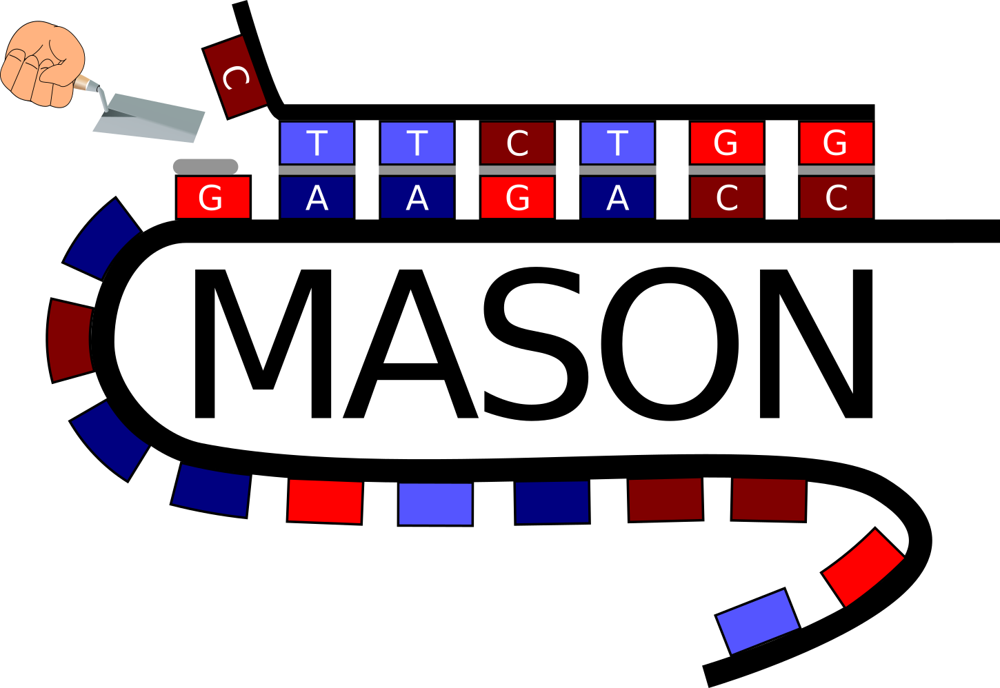

# MASON Webserver



Date: 13-04-2020

Author: Jakob Jung, Patrick Pfau

Supervision: Lars Barquist

This is a basic Webserver for using the MASON algorithm. MASON can be accessed via https://www.helmholtz-hiri.de/en/datasets/mason/. Find below the instructions on how to install the server on a local computer or cluster using a bash shell.

## Requirements

- **OS**: Linux-based system with a bash shell
- **Conda**: [Anaconda](https://docs.anaconda.com/anaconda/install/linux/) or [Miniconda](https://docs.conda.io/projects/conda/en/latest/user-guide/install/linux.html)
- **Git**: [git](https://git-scm.com/book/en/v2/Getting-Started-Installing-Git)
- **VARNA** (optional, for RNA secondary structure plots): Download from https://varna.lisn.upsaclay.fr/ and ensure the `varna` command is available on your `PATH`

### Conda packages installed via `mason_server.yml`

| Category | Packages |
|----------|----------|
| Python | python >=3.12, flask, flask-wtf, biopython, numpy, pandas, matplotlib, seaborn, scikit-learn, openpyxl |
| R | r-base >=4.3, r-ggplot2, r-dplyr, r-readr, r-kableextra, r-viridis, r-writexl, bioconductor-rmelting |
| CLI tools | bedtools, seqmap, bioawk, viennarna (esl-shuffle), openjdk |
| pip | cdifflib |

## Installation

Clone the repository:

```bash
git clone git@github.com:BarquistLab/mason.git
```

Create the conda environment and install all required packages. This can take some minutes:

```bash
cd mason/browser
conda env create --file mason_server.yml
conda activate mason_environment
```

### VARNA setup (optional)

VARNA is a Java applet used to generate RNA secondary structure plots. If you want MASON to produce structure visualizations:

1. Download VARNA from https://varna.lisn.upsaclay.fr/
2. Make sure the `varna` command is on your `PATH` (e.g. place the wrapper script in `~/bin/` or `/usr/local/bin/`)
3. Java (OpenJDK >=11) is included in the conda environment

If VARNA is not installed, MASON will still run but will skip structure plot generation.

## Running the MASON web-server

Activate the conda environment and start the Flask server from the `browser/` directory:

```bash
conda activate mason_environment
python run.py
```

Output should look like:

```
Debug mode: off
Running on http://127.0.0.1:5000/ (Press CTRL+C to quit)
```

Open http://127.0.0.1:5000/ in your browser to use MASON.
